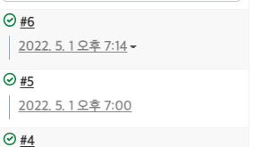

### SpringBootBlog

---

1. 개발 환경
    - Intellij
    - Postman  
    -    
    - GitHub
    - Mysql  
    -   
---
2. **사용기술**
    - 백엔드
        - **주요 프레임워크 / 라이브러리**
            - Java 11 openjdk
            - (안정된 거)SpringBoot  2.6.x
            - SpringBoot Security
            - Spring Data JPA
            - QueryDSL
        - **Build tool**
            - Gradle
        - **DataBase**
            - Mysql
        - **Infra**
            - AWS RDS
            - AWS S3
            - Jenkins
    - ****프론트엔드****
        - Javascript
        - Html/CSS
        - thymeleaf
        - BootStrap 5
    - **라이브러리**
        - Lombok
        - Toast Ui Editor
        - Github-api
---

3. **진행상황**
> 1. 22/05/01  
>    - 젠킨스 연결 및 자동 배포 기능 구현완료  ( github-webhook && ngrok > 로컬 url  -> 임시 외부 url 로 변경 )  
>    
>     

    

### Reference Documentation
For further reference, please consider the following sections:

* [Official Gradle documentation](https://docs.gradle.org)
* [Spring Boot Gradle Plugin Reference Guide](https://docs.spring.io/spring-boot/docs/2.6.7/gradle-plugin/reference/html/)
* [Create an OCI image](https://docs.spring.io/spring-boot/docs/2.6.7/gradle-plugin/reference/html/#build-image)
* [Spring Boot DevTools](https://docs.spring.io/spring-boot/docs/2.6.7/reference/htmlsingle/#using-boot-devtools)
* [Spring Web](https://docs.spring.io/spring-boot/docs/2.6.7/reference/htmlsingle/#boot-features-developing-web-applications)
* [Spring Data JPA](https://docs.spring.io/spring-boot/docs/2.6.7/reference/htmlsingle/#boot-features-jpa-and-spring-data)
* [MyBatis Framework](https://mybatis.org/spring-boot-starter/mybatis-spring-boot-autoconfigure/)
* [Spring for Apache Kafka](https://docs.spring.io/spring-boot/docs/2.6.7/reference/htmlsingle/#boot-features-kafka)
* [Apache Kafka Streams Support](https://docs.spring.io/spring-kafka/docs/current/reference/html/#streams-kafka-streams)
* [Apache Kafka Streams Binding Capabilities of Spring Cloud Stream](https://docs.spring.io/spring-cloud-stream/docs/current/reference/htmlsingle/#_kafka_streams_binding_capabilities_of_spring_cloud_stream)

### Guides
The following guides illustrate how to use some features concretely:

* [Building a RESTful Web Service](https://spring.io/guides/gs/rest-service/)
* [Serving Web Content with Spring MVC](https://spring.io/guides/gs/serving-web-content/)
* [Building REST services with Spring](https://spring.io/guides/tutorials/bookmarks/)
* [Accessing Data with JPA](https://spring.io/guides/gs/accessing-data-jpa/)
* [Accessing data with MySQL](https://spring.io/guides/gs/accessing-data-mysql/)
* [MyBatis Quick Start](https://github.com/mybatis/spring-boot-starter/wiki/Quick-Start)
* [Samples for using Apache Kafka Streams with Spring Cloud stream](https://github.com/spring-cloud/spring-cloud-stream-samples/tree/master/kafka-streams-samples)

