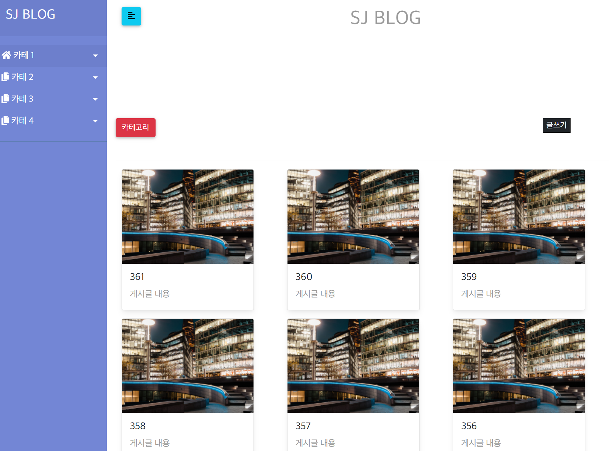
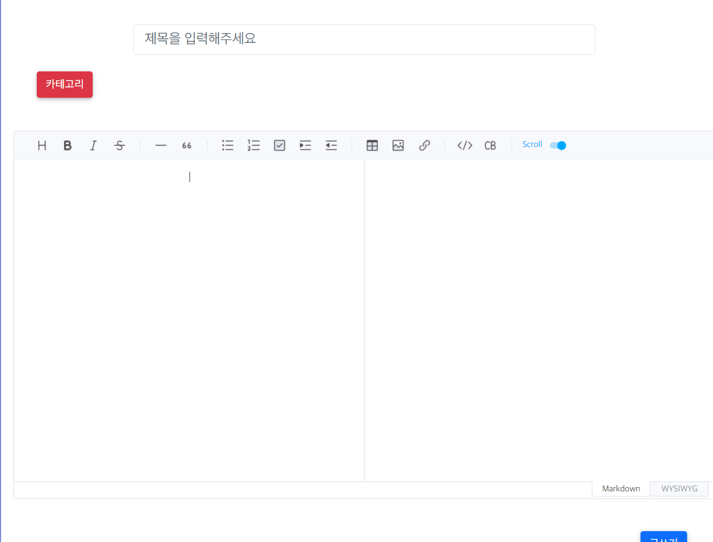
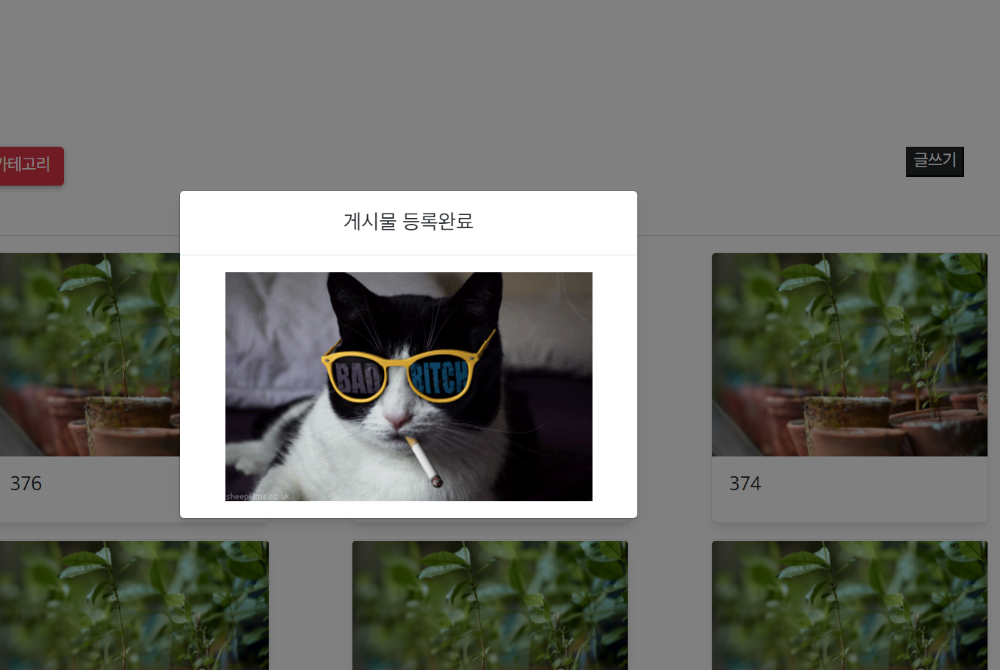

### SpringBootBlog

---

1. 개발 환경
    - Intellij
    - Postman
    -
    - GitHub
    - Mysql
    -

---

2. **사용기술**
    - 백엔드
        - **주요 프레임워크 / 라이브러리**
            - Java 11 openjdk
            - (안정된 거)SpringBoot 2.6.x
            - SpringBoot Security
            - Spring Data JPA
            - QueryDSL
        - **Build tool**
            - Gradle
        - **DataBase**
            - Mysql
        - **Infra**
            - AWS RDS
            - AWS S3
            - Jenkins
    - ****프론트엔드****
        - Javascript
        - Html/CSS
        - thymeleaf
        - BootStrap 5
    - **라이브러리**
        - Lombok
        - Toast Ui Editor
        - Github-api

---

3. **진행상황**

> 1. 22/05/01
>> - 젠킨스 연결 및 자동 배포 기능 구현완료  ( github-webhook && ngrok > 로컬 url -> 임시 외부 url 로 변경 )  
     > 
     > 

- ERD 다이어그램

> 
> 
>
>22/05/03
>> 스웨거 적용
> 
> 코드가 지저분해 진다는 단점은 존재, 하지만 개별 기능에 대한 문서화가 가능한 장점이 있기에 도입.
>
>> 테스트 코드 추가
>
> > JPA 엔티티 구성
>

> 22/05/10
>1. 테스트 코드 작성  
    
>
> ---
**22/05/11**

1. 대충 메인 디자인은 짜긴한듯..?
2. 메인 대충짜고 목록 화면 글작성 화면 짜야함

> 

**22/05/20**

1. 메인 게시물 출력 및 카테고리화
2. 더미데이터 생성
3. 페이지네이션 적용
4. 게시물 작성 마크다운 적용

> 
> 
>
**22/05/20**

1. 게시물 작성 및 메인 페이지 이동
2. 임시 저장 기능 구현중
3. 게시물 마크다운 올바르게 적용안되는 현상

> 

